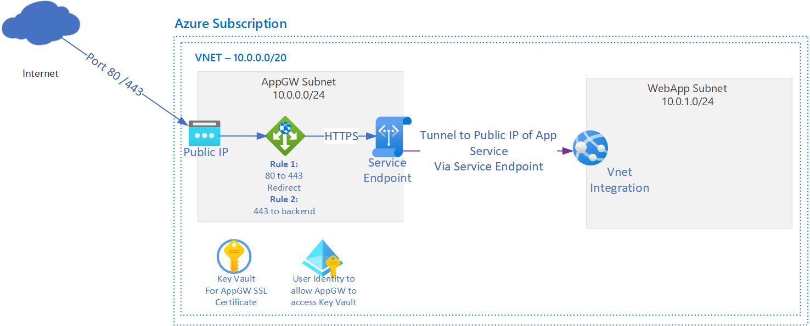

# What's this template do?
This template enforces end-to-end SSL communication through Application Gateway v2 to a backend App Service that is leveraging integrated Azure AD Authentication.

This template will create the following items:
* Virtual Network
  * 2 Subnets
    * One for Application Gateway
    * One for App Service
* App Service Plan
* App Service - Web App
  * Enables AAD Authentication
  * Adds firewall rule to only allow traffic initiated from the subnet that the Application Gateway is deployed to
  * Enables VNet Integrated into App Service subnet
  * Ensures TLS v1.2 is used
* Public IP
  * For application gateway
* Application Gateway
  * 1 Frontend Lister
    * Listening on port 80 and 443
  * 2 Rules
    * HTTP to HTTPS Redirect
    * HTTPS to backend
  * 1 Backend Pool
    * Pointing to App Service Web App
  * HTTPS Health Probe
    * Configured to accept 200-401 response; 401 response needed due to Azure AD Authentication enforcement
* Key Vault
  * Used to store the SSL Certificate used by the Application Gateway
* Key Vault Secret
  * Used to store the SSL certificate used by the Application Gateway
* User Assigned Managed Identity
  * Used to allow the Application Gateway to read the SSL Certificate

Instructions on how to generate Base64 encoded SSL Certificates can be found here: https://jackstromberg.com/2021/03/how-to-generate-base64-encoded-ssl-certificates-via-powershell-for-azure/

# Quick Deployment
  

# Diagram of deployment

# Known limitations
Will not work in Azure Gov Cloud due to limitation of Service Endpoints for App Services.
