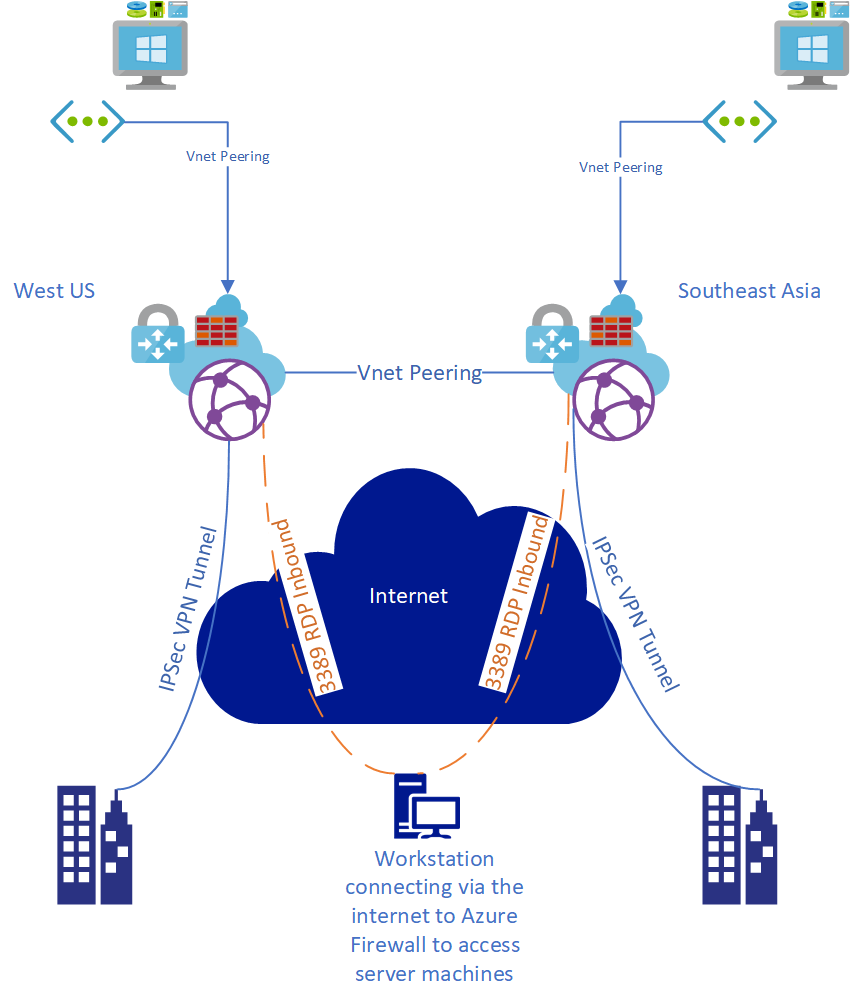

# What's this template do?
This template creates a sample VWAN deployment that creates VPN tunnels, Azure Firewall, Firweall Policy, VM, and VNet to a defined set of regions.

This template will create the following items (all items duplicated per defined region except for the Virtual WAN resource itself):
* Virtual Network
  * 1 Subnet
* Virtual Machine + Managed Disk for OS
  * Managed Disk will be provisioned for the operationg system
  * Standard DS2_v2 sku
  * Server 2019 Datacenter
* Virtual Machine Network Interface
* Public IP for Virtual Machine
* Virtual WAN
* Virtual WAN Hub
* Virtual WAN Virtual Network Connection
* Virtual WAN VPN Gateway
* Virtual WAN VPN Site Link
* Azure Firewall configured with 1 Public IP Address
   * Converts Virtual WAN Hub into a Secured Hub
* Azure Firewall Policy
* Azure Firewall Policy NAT Rule
   * Opens port 3389 to a test VM

The template takes advantage of the copy loop to iterate a defined set of regions specified.  For each region specified, a corresponding VWAN Hub, VWAN Hub VPN Gateway, Site Link, Firewall, Policy, VNet, and VM will be provisioned.

## Note: 
Inter-hub processing of traffic via firewall is currently not supported. Traffic between hubs will be routed to the proper branch within the secured virtual hub, however traffic will bypass the Azure Firewall in each hub.

This template is designed to demonstrate ARM template capabilities with Virtual WAN and to enable testing of various scenarios.  More details on what scenarios are supported with secured virtual hub can be found here: https://docs.microsoft.com/en-us/azure/virtual-wan/virtual-wan-global-transit-network-architecture#security

# Quick Deployment
    

# Diagram of deployment
